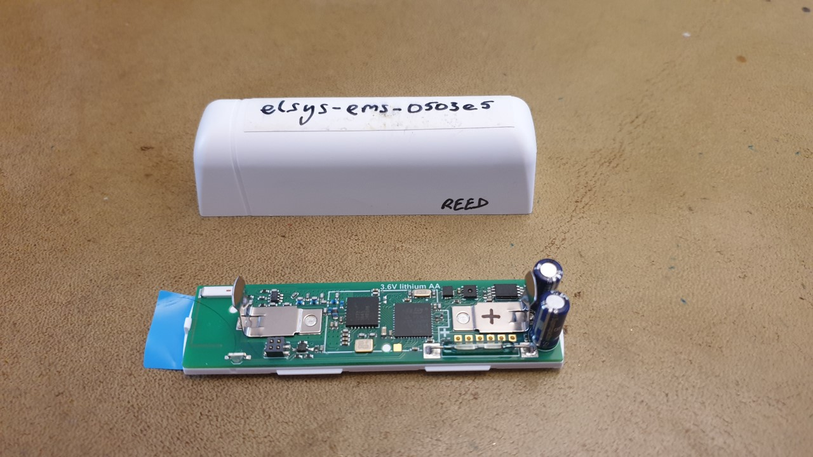

# sensor_elsys_ems
Platform info for EMS sensor from Elsys. Has indoor temperature, humidity, acceleration, a water leak detector, and a reed switch.

[Product homepage](https://www.elsys.se/shop/product/ems-door/)

[Product manual](https://elsys.se/public/manuals/Operating%20_Manual_EMS_Door.pdf)



## Battery

1x 3.6V Lithium AA

Note POSITIVE end is by the two capacitors.

## Add devices to TTN

*Note we can use `acp_ttn_manager` to automate the TTN console device registrations, or manual instructions below:*

Access the [TTN console](https://console.thethingsnetwork.org/applications)

Application **cambridge-sensor-network2**

'Add devices' all the sensors of the same type you'll configure.

Our standardised sensor 'id' format is <make>-<model>-<6-hex-digits>, e.g. `elsys-ems-0503e5` and typically the digits will be 
the last 6 digits of the device `DEVEUI`. We don't *force* this naming standard, but it provides a hint to our `acp_decoders` framework
to infer the data format and decode it and we have existing decoders for quite a few sensor types. You can always add a new decoder if
you have a new/custom sensor.

Use our cambridge-sensor-network standardized APPEUI (ends AB65) and APPKEY (ends 7394)

Edit each device an add a 'description'

## Configure each sensor via an Android phone and NFC app

Use [Elsys Sensor Settings android app](https://play.google.com/store/apps/details?id=se.elsys.nfc.sensorsettings&hl=en_US&gl=US)

Install batteries in all the sensors.

READ the first sensor (App will show the device type and settings)

Set the drop-down menu to "Write Multiple" (if wanted).

The app will ONLY UPDATE SECTIONS WITH TABS OPEN IN THE APP. I.e. only leave the settings sections 'open' 
that you want updated on each device, in particular **Sensor Keys**.

Use our cambridge-sensor-network standardized **APPEUI** (ends AB65) and **APPKEY** (ends 7394)

(maybe we'll have customised sensor settings also, but the defaults seem ok)

Soon after you 'NFC tap' each sensor you should get a 'write confirmation' in the app and a 'green icon' by the sensor
in the TTN console.

## Installation

Label the position of the REED switch.

Add acp_id label.

## See the data on the ACP Platform

```
ls -l /media/acp/mqtt_ttn/data_bin/YYYY/MM/DD/*ACPID*
```
Where `YYYY/MM/DD` is today, `ACPID` is e.g. `elsys-ems-0503e5`
